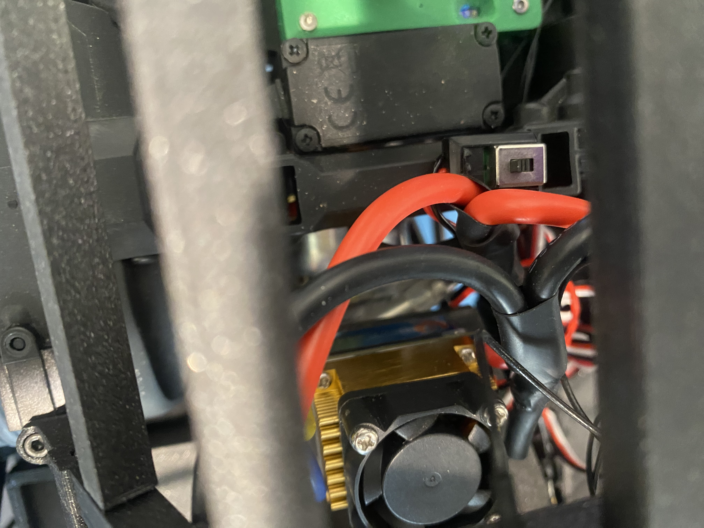
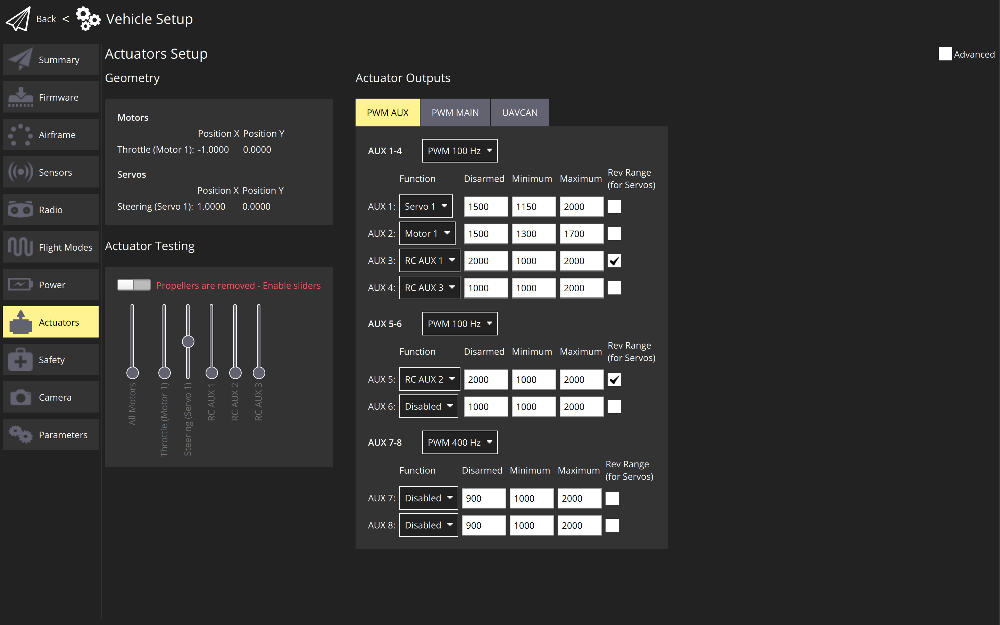

# Cyber Rover
By ARK Electronics 

The "Cyber Rover" as we've come to call it is built on the frame of a Traxxas TRX-4 Bronco. We decided to use this as the base of our rover largely because of the large chassis for mounting multiple components, and the high travel adjustable suspension. We wanted to be able to use this mostly anywhere without fear of it getting stuck or slowed down. 

## Parts List

* [Traxxas TRX-4 Bronco](https://traxxas.com/products/models/electric/trx-4-bronco)
* [ARK Flow](https://arkelectron.com/product/ark-flow/)
* [2x ARK RTK GPS Modules](https://arkelectron.com/product/ark-rtk-gps/)
* [ARK Jetson PAB Carrier](https://arkelectron.com/product/ark-jetson-pab-carrier/)
* [ARKV6X Flight Controller](https://arkelectron.com/product/arkv6x/)
* [ARK Servo Adapter](https://arkelectron.com/product/servo-adapter/)
* [2x ARK PAB Power Modules](https://arkelectron.com/product/ark-pab-power-module/)
* [Yifengdongli 480A Brushed ESC](https://www.amazon.com/gp/product/B09M7CGLZ8/ref=ppx_yo_dt_b_search_asin_title?ie=UTF8&psc=1) set to forward/reverse mode
* [Slamtec RPLidar](https://www.amazon.com/Slamtec-RPLIDAR-Scanning-Avoidance-Navigation/dp/B07TJW5SXF/ref=sr_1_1_sspa?keywords=rplidar&qid=1692035817&sprefix=RPlidar%2Caps%2C177&sr=8-1-spons&ufe=app_do%3Aamzn1.fos.006c50ae-5d4c-4777-9bc0-4513d670b6bc&sp_csd=d2lkZ2V0TmFtZT1zcF9hdGY&psc=1)
* [Luxonis Oak-D Pro Wide Depth Camera](https://www.amazon.com/Luxonis-Oak-D-Pro-Wide-Robotics-Camera/dp/B0BMM63T5Z/ref=sr_1_2?keywords=oak-d+pro+w&qid=1692035889&sprefix=OAK+d+pro+w%2Caps%2C152&sr=8-2&ufe=app_do%3Aamzn1.fos.2b70bf2b-6730-4ccf-ab97-eb60747b8daf)

## Assembly

Mockup of the Roll Cage assembly 

To Build the Cyber Rover we removed the shell from the frame of the vehicle and measured out the distances between existing mounting points. The challenge was finding room to fit all the components onto the chassis while also ensuring that the Lidar wasn't blocked. This led to us removing the existing battery tray and replacing it with a center platform which was the perfect size to place the jetson. We also decided to mount the power modules on the center cross bars to save space and ensure rigidity of the cross bars. Mounting the Jetson in the center instead of the battery also allowed us to mount two battery trays on either side of the rover just above the running boards and between the wheel wells. This was also beneficial in lowering the center of gravity of the rover so it is less likely to roll during fast turns. 

All of the roll cage components were screwed together with M2x16 screws and the whole assembly was mounted to the rover using existing ~M2.5x8 screws. The Lidar was mounted with 4 M2.5x10 screws. The battery trays were mounted with M3x10 screws,The Camera was mounted with 2 M4 screws and the Jetson PAB Case was VHB taped onto the center platform. 

[Cad Files for the Roll Cage and Cases](../../assets/airframes/rover/Cyber_Rover/Cyber_Rover_Cad_Files.zip)

## Wiring the ESC 

We wired the two output sides of the power modules into the single ESC in parallel so that the batteries drain evenly. 

## PWM Channels

PWM Channel| Actuator Output
--- | ---
AUX1 | Low/High Gear Servo
AUX2 | Front Differential Lock/Unlock Servo
AUX3 | Rear Differential Lock/Unlock Servo

## PX4 Configuration

In the airframe section of QGroundControl scroll down and select **Generic Ground Vehicle**

We reduced the motor output while testing to ensure the safety of the rover and components. 

